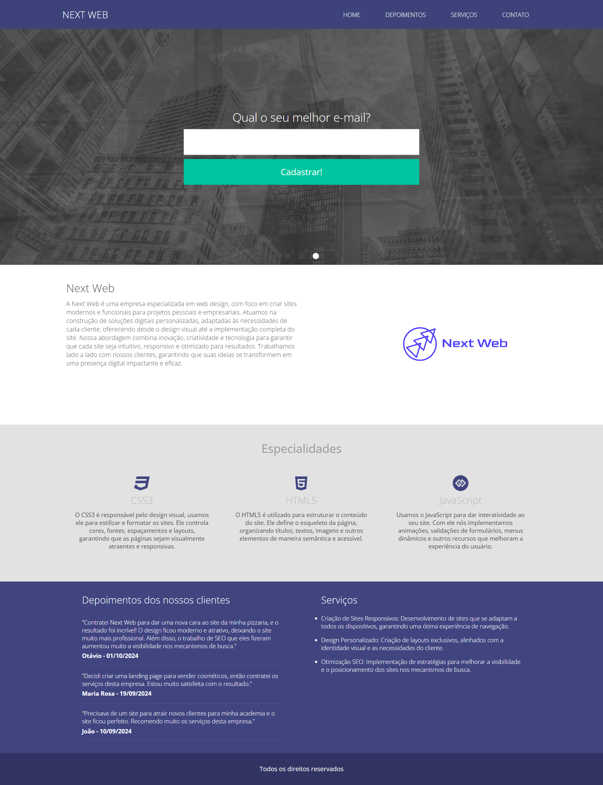
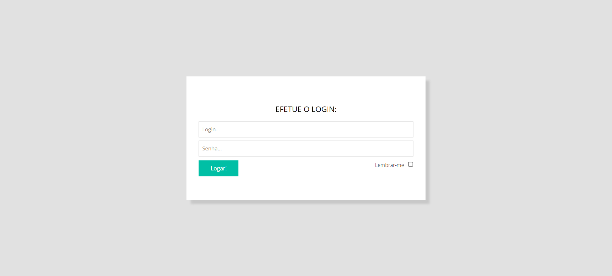
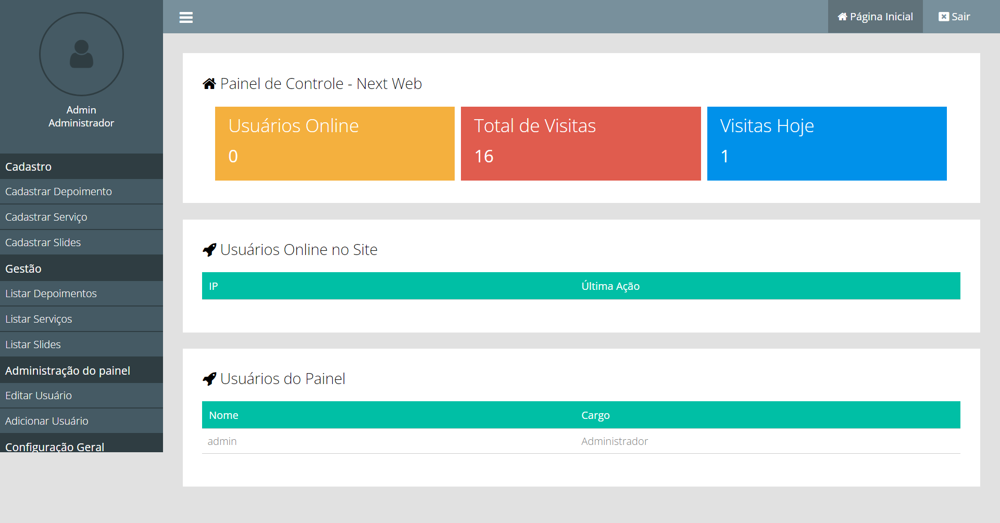

## NextWeb - Projeto de Desenvolvimento Web

<h3>Descrição:</h3>

NextWeb é um site fictício de uma empresa especializada em desenvolvimento web e marketing digital. Este projeto foi criado com o objetivo de demonstrar habilidades tanto no front-end, quanto no back-end utilizando as tecnologias mais modernas e criar uma interface atraente e funcional. O site é totalmente responsivo e apresenta um design intuitivo que exibe de maneira clara as informações e serviços da empresa.

<h3>🎯 Objetivo do Projeto:</h3>

O objetivo principal do NextWeb é servir como uma vitrine de uma empresa fictícia, destacando a experiência em desenvolvimento de sites e serviços de marketing digital. O site permite a exibição dos serviços da empresa, e possui um painel de controle exclusivo para realizar alterações de forma prática, com atualizações automáticas no banco de dados, garantindo que as informações estejam sempre atualizadas.

<h3>🚀 Tecnologias Utilizadas:</h3>
<li>HTML5: Estrutura básica do site, respeitando os padrões de acessibilidade e boas práticas.</li>
 
<li>CSS3: Estilização customizada com foco em responsividade e design moderno.</li>
 
<li>JavaScript: Interatividade do site e integração com funcionalidades dinâmicas.</li>
 
<li>PHP: Integração do painel de controle com o back-end e o banco de dados.</li>
 
<li>MySQL: Utilizado para o armazenamento de todas as informações do site, incluindo dados manipulados através do painel de controle.</li>

<h3>📋 Funcionalidades Principais:</h3>
<li>Responsividade Completa: O site é totalmente responsivo, garantindo uma navegação fluida em qualquer dispositivo, seja desktop, tablet ou celular.</li>
 
<li>Painel de Controle: O NextWeb conta com um painel administrativo exclusivo, onde é possível realizar alterações em tempo real no conteúdo do site. Essas mudanças são automaticamente refletidas no banco de dados.</li>
 
<li>Atualização Dinâmica no Banco de Dados: Toda modificação feita pelo painel de controle é atualizada diretamente no banco de dados MySQL, garantindo que as informações exibidas no site sejam sempre as mais recentes.</li>
 
<li>Design Moderno e Intuitivo: O design foi pensado para oferecer uma experiência de usuário fluida, com uma interface amigável e foco na apresentação clara das informações.</li>

<h3>🛠️ Como Instalar e Executar o Projeto Localmente:</h3>

1 - Clonar o repositório:

git clone https://github.com/devgabrielferraz/nextweb_project

 

2 - Instalar um servidor local:

Para rodar o projeto localmente, você precisará de um servidor local com suporte a PHP e MySQL, como o XAMPP ou WAMP.

 

3- Configurar o banco de dados:

Crie um banco de dados MySQL e importe o arquivo SQL (O arquivo SQL está incluído no projeto "db_nextweb.sql").

Configure o arquivo de conexão com o banco de dados (config.php) para refletir as credenciais do seu ambiente local.

 

4 - Executar o servidor:

Inicie o servidor local (por padrão, o site estará acessível em http://localhost/nome_do_projeto).

 

5 - Acessar o painel de controle:

O painel de controle pode ser acessado por meio do URL http://localhost/nome_do_projeto/painel, onde você poderá fazer as alterações necessárias no conteúdo do site.

 As credenciais de acesso para o painel são:

Login: admin

Senha: admin

 
<h3>🖼️ Screenshots:</h3>

Aqui estão algumas imagens demonstrando as principais seções do site e o painel de controle

 

Imagem do site:

 

Imagem da pagina de login do painel de controle:

Login: admin

Senha: admin

 

Imagem do painel de controle:

